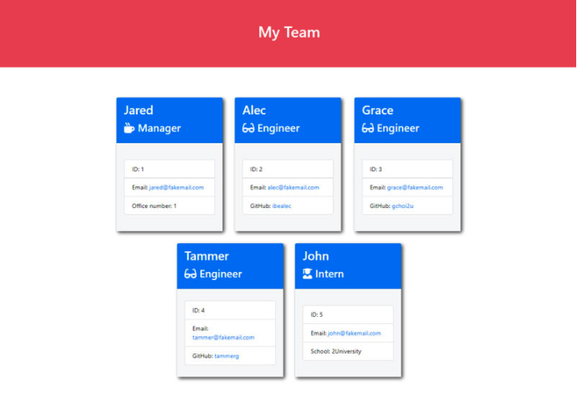
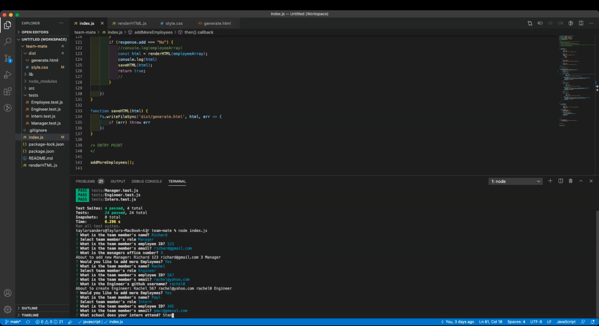

# team-mate

<h2 style="display: inline-block">Table of Contents</h2>

<ol>
<li>
<a href="#description">Description</a>
</li>
<li>
<a href="#getting-started">Getting Started</a>
</li>
<li>
<a href="#installation">Installation</a>
</li>
<li>
<a href="#tests">Tests</a>
</li>
<li>
<a href="#usage">Usage</a>
</li>
<li>
<a href="#license">License</a>
</li>
<li>
<a href="#contribute">Contribute</a>
</li>
<li>
<a href="#questions">Questions</a>
</li>
</ol>

## Description

This is a Node.js command-line application that takes in information about employees on a software engineering team, then generates an HTML webpage that displays summaries for each person. It also contains a unit test for every part of the code to ensure that it passes each test.

## Getting Started

To get a local copy up and running follow these simple steps. You can also download the source files provided. You will need a text editor such as Visual Studio Code.

## Tests

If you would like to test this project, run npm test.

## Usage

🎥 The full movie file showing functionality of the application can be found [here](https://drive.google.com/file/d/1MGzg6JSQKNIcOWNTXAhQtupZlzFO1w5x/view?usp=sharing)

In your terminal run the app with the command node index.js. Enter your employee details when prompted. Add additional members and select their role. After all members have been added, your HTML will be generated in the dist/ folder.

## License

MIT | See badge above.

## Questions?

If you have any additional questions, email me here: tsanders3515@gmail.com
 Or visit my GitHub profile here: github.com/justpeachy8688
